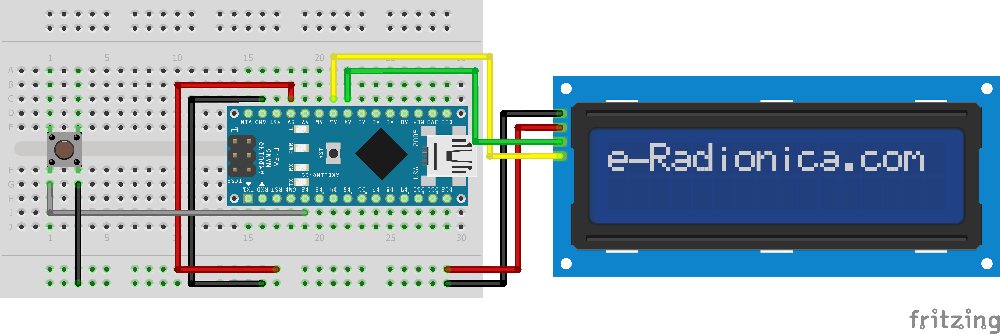

````markdown
# 🦖 Chrome Dino Game on 16x2 LCD (Arduino)

Recreated the **Chrome Dino Game** on a **16x2 I2C LCD** using **Arduino Nano**.  
The Dino jumps over obstacles like cactuses 🌵 and birds 🐦.  
````


````
## 🎮 Features
- Dino character with jump animation  
- Obstacles: multiple cactus types & flying birds  
- Collision detection (Game Over screen)  
- Jump counter displayed on LCD  
- Restart option via push button  
- Randomized obstacles for replayability  

---

## 🛠️ Hardware Requirements
- Arduino Nano (or Uno, Pro Mini, ESP32, etc.)  
- 16x2 I2C LCD display  
- 1 push button (for jump/restart)  
- Breadboard & jumper wires

````
## 🔌 Circuit Diagram  

````
Connections:  
- LCD VCC → 5V  
- LCD GND → GND  
- LCD SDA → A4 (Nano)  
- LCD SCL → A5 (Nano)  
- Button → D2 (with pull-down or INPUT_PULLUP mode)

---

## 📜 Installation & Usage
1. Install Arduino IDE  
2. Install the **LiquidCrystal_I2C** library  
3. Clone this repo:
   ```bash
   git clone https://github.com/yourusername/lcd-chrome-dino.git
````

4. Open the `.ino` file in Arduino IDE
5. Select your board & port → Upload 🚀

---

## 📸 Demo

*(You can add GIF or video later)*

---

## 📄 License

This project is licensed under the [MIT License](LICENSE).

---

## 🌟 Contribute

Pull requests are welcome! Feel free to fork & improve (new obstacles, sounds, etc.).

---

`Arduino Nano` `LCD` `I2C` `Game Development` `Electronics` `Hardware Projects` `C++`


